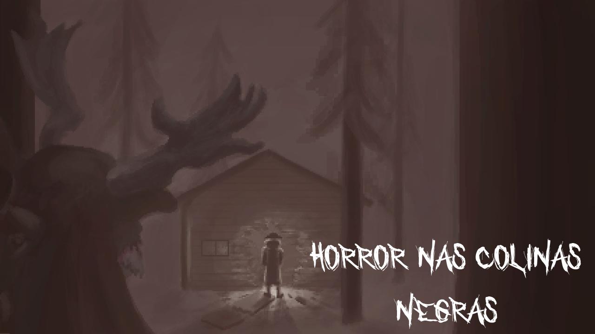
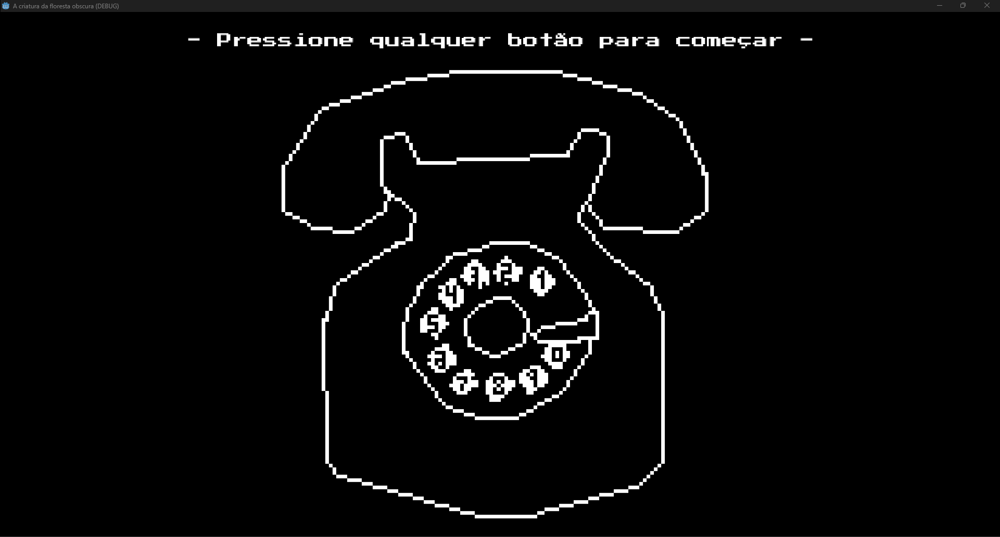
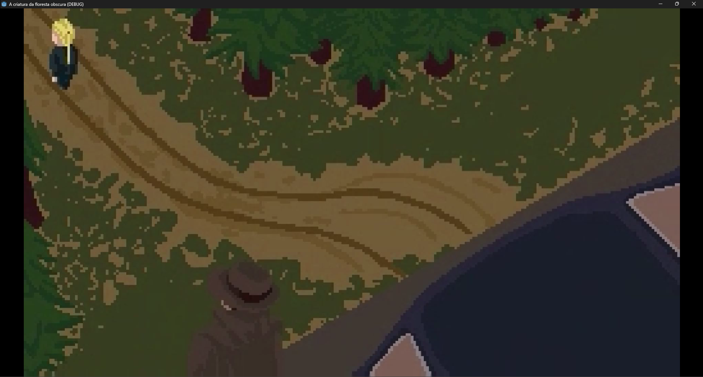
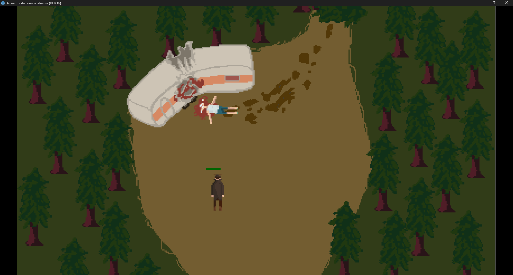
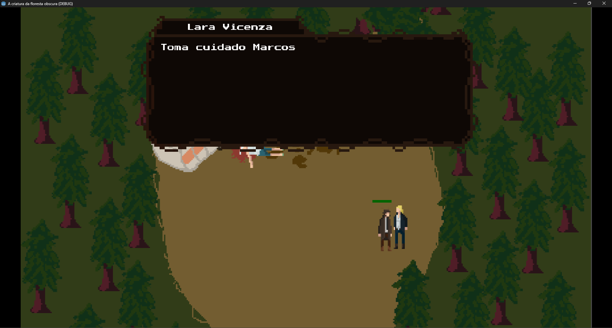
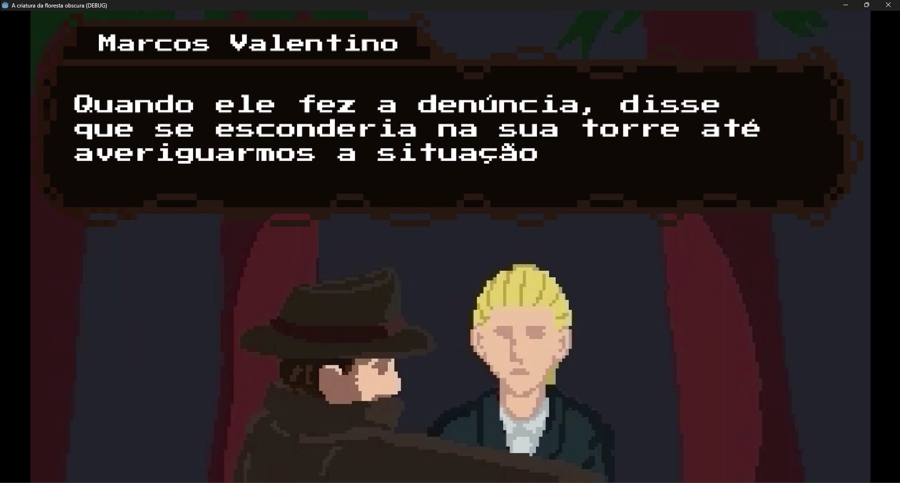

# Horror nas Colinas Negras

## Description
Horror nas Colinas Negras is a 2D animation project, developed in Godot Engine, that tells the story of two detectives who are investigating a series of murders in the middle of the forest.

#### Know the characters
- **Marcos Valentino**: A clumsy and extroverted detective. He's always trying to make jokes, taking the weight off any situation. He has a positive mindset, but can that positivity be enough to get through the horrors of the forest?

- **Lara Vicenza**: A young detective that is always focused and serious, only laughing at Marcus jokes. She takes precautions in every situation, and is ready for anything. Unfortunately, there's no preparation that she can do to escape what awaits her in the forest.

## ScreenShots

## Credits
- **Project Documentation**: Murilo Estacio

- **Cutscenes**: Fernando Humberto Gazola Marques

- **Gameplay Art**: [Theo Fernandes dos Santos Dias](https://github.com/F3rnDev)

- **Audio**: Hugo Mafra Gomes, [Theo Fernandes dos Santos Dias](https://github.com/F3rnDev)

- **Programming**: [Otávio Luiz de Souza](https://github.com/Otaviopax), [Theo Fernandes dos Santos Dias](https://github.com/F3rnDev)